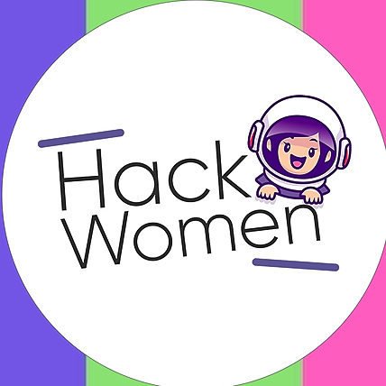

# Intro-Github

# Introducción a Github

## Charla-Taller
Taller desarrollado por el **Google Developer Student Club de la Universidad de Guanajuato** en colaboración por parte del programa *SKILLS FOR WOMEN IN TECH* y junto a **BRITISH COUNCIL** para la capacitación-actualización de un grupo de estudiantes y profesores de la Casa de Estudios.
 Sesion de github

## insertaremos una imagen

